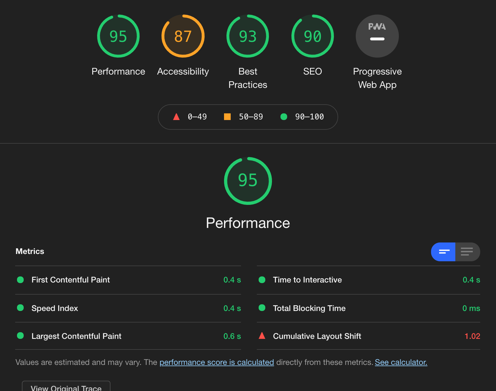
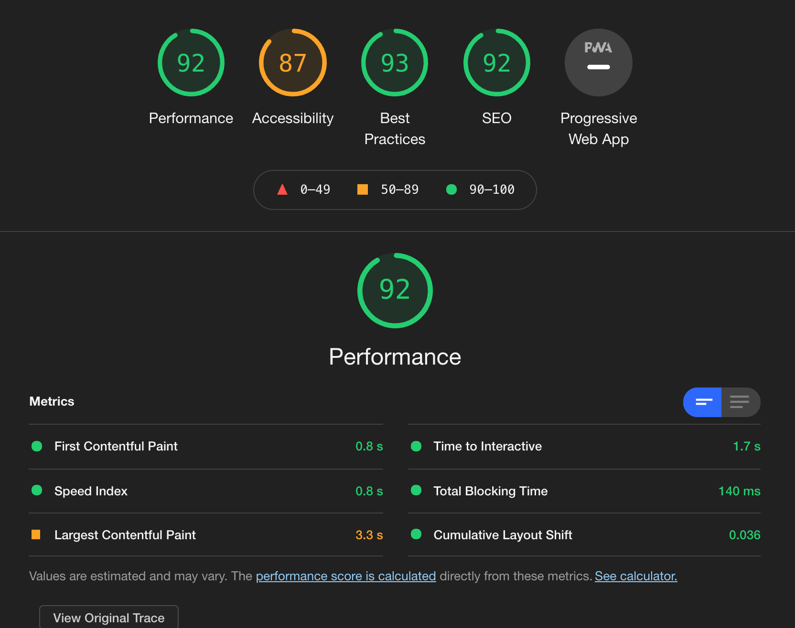

# RPG_JS
# Welcome to "Sorry Square Enix"

## Progression

Status : OVER. (7 days of work)

The project's progression can be seen [here](https://etienne223.github.io/RPG_JS) 

## Who worked on it ?

- Etienne Lefèvre - @[Etienne223](https://github.com/Etienne223) a.k.a Tienou 🦝

## Used technologies 

- Terminal - Git
- Github
- Adobe Xd (Mock-ups and design)
- Visual Studio Code (Text editor)
- Sass
- HTML 5
- JavaScript

## Goal of the challenge

The main goal of this challenge is to get better with JS :  
- DOM manipulation
- forms input
- Understand JSON
- Understand Basic JS
- Have Extra Fun (and I did have some real extra fun with this challenge)

So I was asked to create an RPG in which 2 people can locally battle each other. For that we had extra infos about the characters and items specs that will take place if they're choosen by the player. It was recommanded to use two JS files. One that'll handle the character creation (name, race, item) and another one that'll handle all the gamelogics (what happen if you click on a button to attack, heal, yield and how the items et character interact between them). 

You can see all the details [here](https://github.com/becodeorg/BXL-Swartz-4-27/blob/master/2.The-Hill/1.Javascript/rpg-project/README.md).

Reminder for later : I know how to design mobile first so next time I'll be doing me a favor if I did so. My RPG is not responsive, at least all the animation and graphics so I have to be more focused on that next time.

## LightHouse

### Desktop

### Mobile

